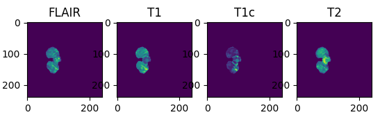
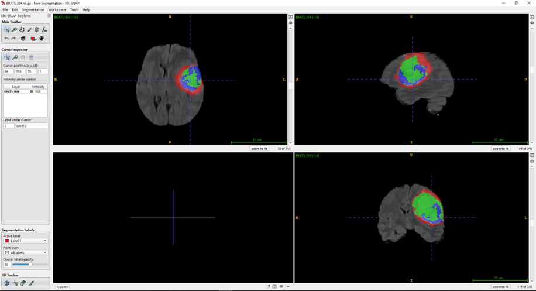

# BRATS2DUnet
Brats 2D dataset trained on Unet with Monai Lib


#### Installation 
```
conda create -n monai python=3.9 --no-default-packages
conda activate monai
conda install nvidia/label/cuda-11.7.1::cuda-toolkit
conda install pytorch==2.0.1 torchvision==0.15.2 pytorch-cuda=11.7 -c pytorch -c nvidia
pip install monai matplotlib scipy tqdm nibabel
```

### Data
<!--  -->


#### Sanity Train
```
!python -m torch.distributed.launch --use_env --nproc_per_node=1 /kaggle/working/BRATS2DUnet/TrainUnet2D.py --sanity_test=True --root_dir="/kaggle/working/BRATS2DUnet" --output_dir="/kaggle/working/BRATS2DUnet/output" --batch_size=64 --epochs=10
```

#### Train
```
!python -m torch.distributed.launch --use_env --nproc_per_node=1 /kaggle/working/BRATS2DUnet/TrainUnet2D.py --sanity_test=False --root_dir="/kaggle/working/BRATS2DUnet" --output_dir="/kaggle/working/BRATS2DUnet/output" --batch_size=64 --epochs=100
```
